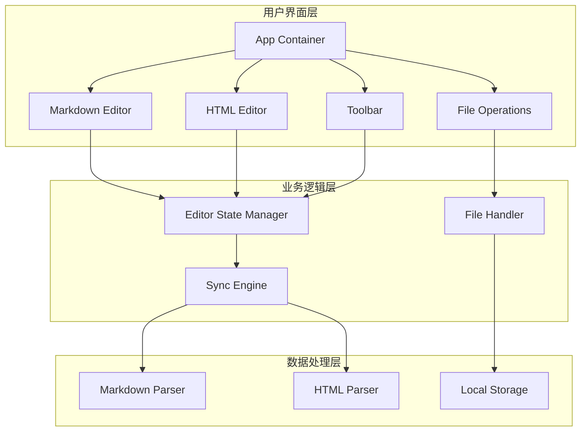

# 设计文档

## 概述

Markdown-HTML双向编辑器是一个基于React的Web应用程序，提供两种编辑模式：Markdown源码编辑和HTML可视化编辑。系统采用模块化架构，通过双向解析引擎实现两种格式之间的无缝转换，并提供完整的文件操作功能。

核心设计理念：
- **双界面架构**：独立的Markdown编辑器和HTML编辑器
- **实时同步**：两种模式之间的数据实时同步
- **性能优化**：支持大文档编辑和快速响应
- **专业体验**：AWS风格的用户界面和交互

## 架构

### 系统架构图



### 技术栈选择

**前端框架**: React 18+
- 理由：成熟的生态系统，优秀的性能，丰富的组件库支持

**代码编辑器**: Monaco Editor
- 理由：VS Code同款编辑器，内置语法高亮，丰富的编辑功能

**Markdown解析**: marked.js
- 理由：轻量级，高性能，广泛使用，支持扩展

**HTML转Markdown**: turndown.js
- 理由：专业的HTML到Markdown转换库，可配置性强

**拖拽功能**: react-dnd
- 理由：React生态中最成熟的拖拽解决方案

**样式框架**: Tailwind CSS
- 理由：实用优先的CSS框架，便于实现AWS风格设计

## 组件和接口

### 核心组件架构

#### 1. App Container
```typescript
interface AppProps {
  initialContent?: string;
  initialMode?: 'markdown' | 'html';
}

interface AppState {
  currentMode: 'markdown' | 'html';
  content: {
    markdown: string;
    html: string;
  };
  isLoading: boolean;
  isDirty: boolean;
}
```

#### 2. Markdown Editor
```typescript
interface MarkdownEditorProps {
  content: string;
  onChange: (content: string) => void;
  onSave: () => void;
  readOnly?: boolean;
}

interface MarkdownEditorFeatures {
  syntaxHighlighting: boolean;
  lineNumbers: boolean;
  codeFolding: boolean;
  searchReplace: boolean;
  realTimePreview: boolean;
}
```

#### 3. HTML Editor
```typescript
interface HTMLEditorProps {
  content: string;
  onChange: (content: string) => void;
  onSave: () => void;
  readOnly?: boolean;
}

interface HTMLEditorFeatures {
  dragAndDrop: boolean;
  textFormatting: boolean;
  linkManagement: boolean;
  layoutAdjustment: boolean;
}
```

#### 4. Sync Engine
```typescript
interface SyncEngine {
  markdownToHtml(markdown: string): Promise<string>;
  htmlToMarkdown(html: string): Promise<string>;
  validateSync(markdown: string, html: string): boolean;
}

interface SyncOptions {
  preserveFormatting: boolean;
  handleUnsupportedElements: 'preserve' | 'remove' | 'convert';
  customRules?: ConversionRule[];
}
```

#### 5. File Handler
```typescript
interface FileHandler {
  save(content: string, format: 'md' | 'html'): Promise<void>;
  load(file: File): Promise<string>;
  export(content: string, format: 'md' | 'html'): void;
}

interface FileOperations {
  supportedFormats: string[];
  maxFileSize: number;
  autoSave: boolean;
  localStorageKey: string;
}
```

### 状态管理

使用React Context + useReducer模式管理全局状态：

```typescript
interface EditorState {
  mode: 'markdown' | 'html';
  content: {
    markdown: string;
    html: string;
  };
  ui: {
    isLoading: boolean;
    isDirty: boolean;
    showPreview: boolean;
  };
  settings: {
    theme: string;
    fontSize: number;
    autoSave: boolean;
  };
}

type EditorAction = 
  | { type: 'SWITCH_MODE'; payload: 'markdown' | 'html' }
  | { type: 'UPDATE_CONTENT'; payload: { type: 'markdown' | 'html'; content: string } }
  | { type: 'SET_LOADING'; payload: boolean }
  | { type: 'SAVE_SUCCESS' }
  | { type: 'LOAD_FILE'; payload: string };
```

## 数据模型

### 内容数据结构

```typescript
interface DocumentContent {
  id: string;
  title: string;
  markdown: string;
  html: string;
  metadata: {
    createdAt: Date;
    updatedAt: Date;
    version: number;
    checksum: string;
  };
}

interface EditorSettings {
  theme: 'light' | 'dark' | 'aws';
  fontSize: number;
  tabSize: number;
  wordWrap: boolean;
  minimap: boolean;
  autoSave: boolean;
  autoSaveInterval: number;
}
```

### 本地存储结构

```typescript
interface LocalStorageData {
  documents: DocumentContent[];
  settings: EditorSettings;
  recentFiles: string[];
  lastOpenDocument: string | null;
}
```

## 正确性属性

*属性是一个特征或行为，应该在系统的所有有效执行中保持为真——本质上，是关于系统应该做什么的正式声明。属性作为人类可读规范和机器可验证正确性保证之间的桥梁。*

现在我需要使用prework工具来分析验收标准的可测试性：
基于预工作分析，我识别出以下可测试的正确性属性：

### 属性反思

在编写正确性属性之前，我需要识别和消除冗余：

1. **转换相关属性**：4.1和4.2可以合并为一个往返转换属性（4.3），因为往返转换已经包含了双向转换的正确性
2. **界面切换属性**：1.2和6.2都涉及界面切换的性能要求，可以合并为一个属性
3. **文件操作属性**：5.1和5.2都是关于文件保存/导出，可以合并为一个通用的文件操作属性

### 正确性属性

**属性 1：界面切换内容保持**
*对于任何*编辑内容，当在Markdown和HTML界面之间切换时，内容应该保持不变且切换应在300ms内完成
**验证：需求 1.2, 1.3, 6.2**

**属性 2：Markdown到HTML转换正确性**
*对于任何*有效的Markdown内容，转换为HTML后应该保持语义结构和格式信息
**验证：需求 1.4, 4.1**

**属性 3：HTML到Markdown转换正确性**
*对于任何*有效的HTML内容，转换为Markdown后应该保持语义结构和格式信息
**验证：需求 1.5, 4.2**

**属性 4：往返转换一致性**
*对于任何*文档内容，经过Markdown→HTML→Markdown或HTML→Markdown→HTML的往返转换后，应该保持语义等价
**验证：需求 4.3**

**属性 5：Markdown编辑器功能完整性**
*对于任何*Markdown内容，编辑器应该提供语法高亮、实时预览、代码折叠、行号显示和搜索替换功能
**验证：需求 2.1, 2.2, 2.3, 2.4, 2.5**

**属性 6：HTML编辑器操作支持**
*对于任何*HTML元素，编辑器应该支持删除、拖拽移动、复制粘贴、文本格式化、链接管理和布局调整操作
**验证：需求 3.1, 3.2, 3.3, 3.4, 3.5, 3.6**

**属性 7：文件操作正确性**
*对于任何*文档内容，应该能够正确保存为.md格式、导出为.html格式，并且能够正确导入.md、.html和.txt文件
**验证：需求 5.1, 5.2, 5.3, 5.4, 5.5**

**属性 8：本地存储恢复**
*对于任何*保存到本地存储的内容，重新打开应用时应该能够完整恢复
**验证：需求 5.6**

**属性 9：不支持格式优雅处理**
*对于任何*包含不支持格式的内容，转换过程应该优雅处理并保留原始内容
**验证：需求 4.4**

**属性 10：防抖机制有效性**
*对于任何*快速连续的输入操作，实时预览应该使用防抖机制避免频繁更新
**验证：需求 6.5**

## 错误处理

### 错误类型和处理策略

#### 1. 解析错误
- **Markdown解析错误**：显示错误位置，提供修复建议
- **HTML解析错误**：标记无效标签，提供清理选项
- **转换失败**：回退到原始内容，记录错误日志

#### 2. 文件操作错误
- **文件读取失败**：显示友好错误信息，支持重试
- **文件保存失败**：提示用户检查权限，提供另存为选项
- **格式不支持**：显示支持的格式列表，提供转换建议

#### 3. 性能相关错误
- **大文件处理**：分块加载，显示进度条
- **内存不足**：自动清理缓存，提示用户保存工作
- **响应超时**：显示加载状态，提供取消选项

#### 4. 网络和存储错误
- **本地存储失败**：提示用户清理存储空间
- **浏览器兼容性**：显示兼容性提示，提供降级方案

### 错误恢复机制

```typescript
interface ErrorRecovery {
  autoSave: {
    interval: number;
    maxVersions: number;
    storageKey: string;
  };
  
  fallback: {
    useSimpleEditor: boolean;
    disableAdvancedFeatures: boolean;
    showCompatibilityWarning: boolean;
  };
  
  retry: {
    maxAttempts: number;
    backoffStrategy: 'linear' | 'exponential';
    retryableErrors: string[];
  };
}
```

## 测试策略

### 双重测试方法

我们将采用单元测试和基于属性的测试相结合的方法：

**单元测试**：
- 验证特定示例和边界情况
- 测试组件集成点
- 验证错误条件处理
- 测试用户界面交互

**基于属性的测试**：
- 验证通用属性在所有输入中成立
- 通过随机化实现全面的输入覆盖
- 每个正确性属性对应一个基于属性的测试
- 最少100次迭代以确保可靠性

### 基于属性的测试配置

**测试库选择**：fast-check (JavaScript/TypeScript的成熟属性测试库)

**测试配置**：
- 每个属性测试最少100次迭代
- 使用智能生成器约束输入空间
- 每个测试必须引用其设计文档属性
- 标签格式：**Feature: markdown-html-editor, Property {number}: {property_text}**

### 测试覆盖范围

**核心功能测试**：
- Markdown解析和渲染
- HTML编辑和操作
- 双向内容转换
- 文件操作和存储

**性能测试**：
- 界面切换响应时间
- 大文档处理能力
- 内存使用监控
- 防抖机制验证

**兼容性测试**：
- 跨浏览器功能验证
- 响应式设计测试
- 文件格式兼容性

**用户体验测试**：
- 界面交互流畅性
- 错误处理友好性
- 数据持久性验证

### 测试数据生成策略

**Markdown内容生成器**：
- 标准Markdown语法元素
- 嵌套结构和复杂格式
- 边界情况（空内容、超长文本）
- 特殊字符和Unicode支持

**HTML内容生成器**：
- 标准HTML标签和属性
- 嵌套结构和复杂布局
- 内联样式和CSS类
- 无效标签和格式错误

**文件操作生成器**：
- 不同大小的文件内容
- 各种文件格式和编码
- 损坏或无效的文件数据
- 边界情况（空文件、超大文件）